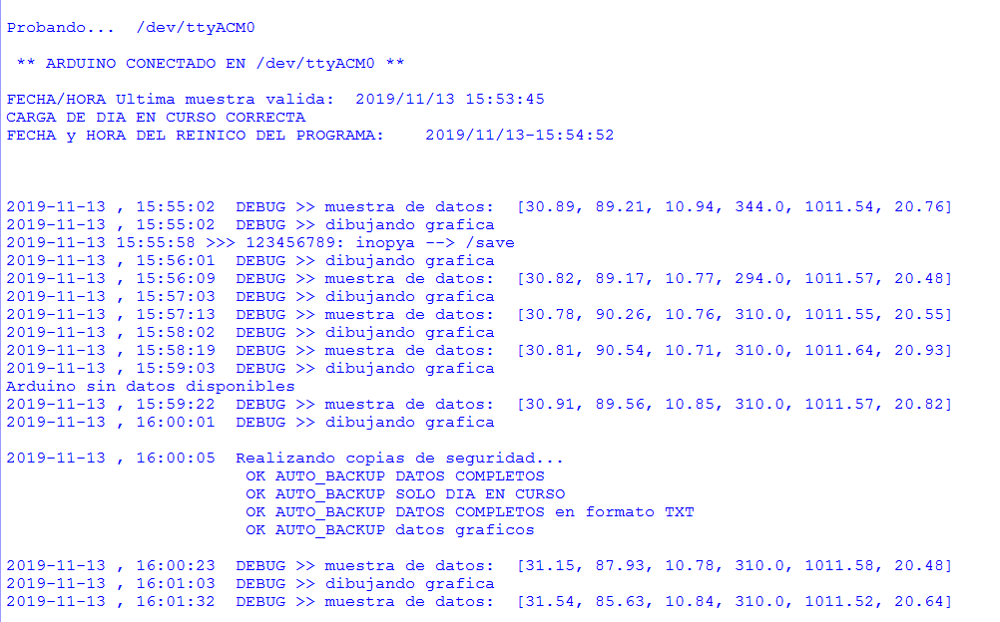

# Mini tierra
***Experimento bioclimatico y utilidades***

#### Reproduciendo en casa el experimento bioclimatico presentado en el biotecnoencuentro de Pulpi en octubre de 2019

                Recipiente de Mini tierra 

***UN POCO DE HISTORIA***

Primero de todo, que dicho experimento aun se puede encontrar en el repositorio https://github.com/inopya/Biot.

Dado que el programa de adquisision de datos de Biot fue una version bastante reducida de mi estacion meteorológica @meteosorbasbot, en esta reproduccion casera de dicho experimento sobre los gases de efecto invernadero se 
ha usado una version mas parecida a mi programa base de adquisicion y representacion (aunque no completa). No elimino de momento el repositorio original del Biot, pero es conveniente usar los programas de aqui en lugar de aquellos.

***CONTENIDO DE ESTE REPOSITORIO***

* CARPETA> calibracion_MQxx:
 *Utilidad Arduino para la calibracion del MQ135 para CO2*
* CARPETA> calibracion_sonda_PH:
 *Utilidad Arduino para la calibracion de la sonda de Ph*
* CARPETA> generar_datos_para_debug:
 *Utilidad Arduino para generar datos aleatorios. Para pruebas con el programa de adquisicion python.*
* CARPETA> imagenes:
 *Algunas imagenes del montaje y ejemplo de graficos obtenidos durante el experimento.*
* CARPETA> minitierra_v1.0:
 *Fichero Arduino para el experimento como tal*
 
* FICHERO> capturar_datos_experimento.py: 
 *Archivo Python para la adquisicion de datos, registro, representacion y comunicacion telegram*
* FICHERO> extraer_diarios.py: 
 *Utilidad Python paratrocear por dias el fichero de datos generado durante la adquisicion*
* FICHERO> graficar_diarios.py: 
 *Utilidad Python para generar graficas desde los ficheros diarios de datos*
 
* FICHERO> experimento_minitierra_full.txt: 
 *Resultados del mi experimento durante los dias 03/11/2019 al 12/11/2019. Desde el se pueden exrtaer los diarios y graficarlos con     las utilidades python que hay en este repositorio*
 
 
***MODO DE EMPLEO***

    Leer el fichero **README_python.md** para una descripcion detallada del programa de captura
    
    
  
***SENSORES EMPLEADOS***

**MQ-135**  --->  CO2 _(interior del recipiente)_

**GY-21**  --->  HUMEDAD y TEMPERATURA _(interior del recipiente)_

**Sonda PH 0-14**  -->  PH _(interior del recipiente)_

**BMP180**  --->  TEMPERATURA y PRESION ATMOSF. _(exterior del recipiente)_

* ***grafica original***

Grafica de un momento del experimento en el que se aprecia el ruido de los sensores analogicos.
(En la grafica se ven datos de indice UV, sensor del que no se habla en el montaje. Dichos valores estan tomados desde mi estacion meteorologica que si dispone de dicho sensor y han sido sustituidos por los de presion al momento de hacer estas representaciones de muestra)

* ***grafica suavizada***

Grafica del mismo momento del experimento, pero aplicando la reduccion de ruido.
Se debe recordar que no afecta a los valores que se guardan, solo a la representacion grafica.

* ***Consola del programa***

Ejemplo de informacion mostrada por consola durante el funcionamineto del programa

