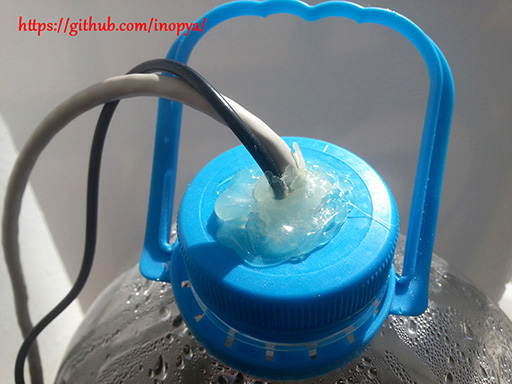

## IMAGENES

* ***detalle_cierre.jpg***

[Detalle del sellado de 'minitierra'](https://github.com/inopya/mini-tierra/tree/master/imagenes/detalle_cierre.jpg)

* ***detalle_conexion.jpg***

[Detalle de los zocalos](https://github.com/inopya/mini-tierra/tree/master/imagenes/detalle_conexion.jpg)  hechos para una comoda conexion de los sensores.

* ***grafica_raw.png***

Grafica de un momento del experimento en el que se aprecia el ruido de los sensores analogicos.
(En la grafica se ven datos de indice UV, sensor del que no se habla en el montaje. Dichos valores estan tomados desde mi estacion meteorologica que si dispone de dicho sensor y han sido sustituidos por los de presion al momento de hacer estas representaciones de muestra)
[Grafica Raw Big](https://github.com/inopya/mini-tierra/imagenes/tree/master/grafica_raw.png)

* ***grafica_soft.png***

Grafica del mismo momento del experimento, pero aplicando la reduccion de ruido.
Se debe recordar que no afecta a los valores que se guardan, solo a la representacion grafica.
[Grafica Soft Big](https://github.com/inopya/mini-tierra/imagenes/tree/master/grafica_soft.png)

* ***micro_protoboard.jpg***

Ejemplo de montaje ([original Biot](https://github.com/inopya/mini-tierra/tree/master/imagenes/micro_protoboard.jpg)) en protoboard usando Arduino Micro. 

* ***nano_escudo.jpg***

Montaje usando [Arduino Nano y escudo](https://github.com/inopya/mini-tierra/tree/master/imagenes/nano_escudo.jpg) para facilitar las conexiones.

* ***recipiente.jpg***

Esta es ['minitierra'](https://github.com/inopya/mini-tierra/tree/master/imagenes/recipiente.jpg). Un poco de agua de charca en una garrafa de 5 litros :)

* ***sensores.jpg***

[Sensores con su cableado](https://github.com/inopya/mini-tierra/tree/master/imagenes/sensores.jpg), listos para el experimento.
