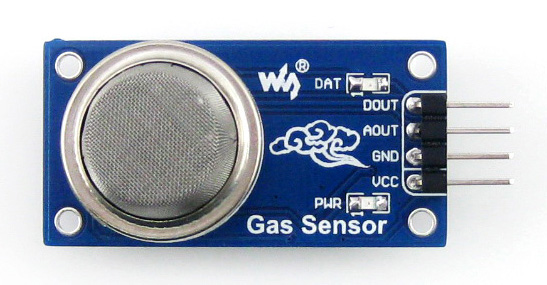

# INFORMACION SOBRE LOS SENSORES 

## **Sensor de Gases MQ-135**

Este sensor es sensible a varios gases: amoniaco, benceno y alcohol, humo, CO2...

De hecho no es idoneo para CO2, pero si que es una solucion barata para iniciarse en la deteccion de gases.

* **Pines:**

  - DOUT    Salida digital que se activa ante un determinado umbral
  - AOUT    Salida analogica, es la realmente util para obtener medidas de gas
  - GND     Masa del circuito
  - VCC     5V DC
  
  
